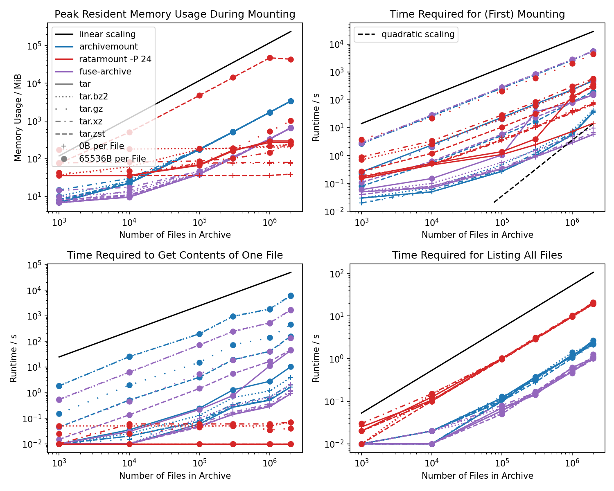

# Random Access Read-Only Tar Mount (Ratarmount)

[](https://badge.fury.io/py/ratarmount)
[](https://pypi.org/project/indexed-bzip2/)
[](https://pepy.tech/project/ratarmount)
[](http://opensource.org/licenses/MIT)
[](https://github.com/mxmlnkn/ratarmount/actions)
[](https://discord.gg/Wra6t6akh2)
[](https://t.me/joinchat/FUdXxkXIv6c4Ib8bgaSxNg)

Combines the random access indexing idea from [tarindexer](https://github.com/devsnd/tarindexer) and then **mounts** the **TAR** using [fusepy](https://github.com/fusepy/fusepy) for easy read-only access just like [archivemount](https://github.com/cybernoid/archivemount/).
In [contrast](https://github.com/libarchive/libarchive#notes-about-the-library-design) to [libarchive](https://github.com/libarchive/libarchive), on which archivemount is based, random access and true seeking is supported.

*Other capabilities:*

 - **Recursive Mounting:** Ratarmount will also mount TARs inside TARs inside TARs, ... recursively into folders of the same name, which is useful for the 1.31TB ImageNet data set.
 - **Mount Compressed Files:** You may also mount files with one of the supported compression schemes. Even if these files do not contain a TAR, you can leverage ratarmount's true seeking capabilities when opening the mounted uncompressed view of such a file.
 - **Read-Only Bind Mounting:** Folders may be mounted read-only to other folders for usecases like merging a backup TAR with newer versions of those files residing in a normal folder.
 - **Union Mounting:** Multiple TARs, compressed files, and bind mounted folders can be mounted under the same mountpoint.

*Compressions supported for random access:*

 - **BZip2** as provided by [indexed_bzip2](https://github.com/mxmlnkn/indexed_bzip2) as a backend, which is a refactored and extended version of [bzcat](https://github.com/landley/toybox/blob/c77b66455762f42bb824c1aa8cc60e7f4d44bdab/toys/other/bzcat.c) from [toybox](https://landley.net/code/toybox/). See also the [reverse engineered specification](https://github.com/dsnet/compress/blob/master/doc/bzip2-format.pdf).
 - **Gzip** as provided by [indexed_gzip](https://github.com/pauldmccarthy/indexed_gzip) by Paul McCarthy. See also [RFC1952](https://tools.ietf.org/html/rfc1952).
 - **Rar** as provided by [rarfile](https://github.com/markokr/rarfile) by Marko Kreen. See also the [RAR 5.0 archive format](https://www.rarlab.com/technote.htm).
 - **Xz** as provided by [lzmaffi](https://github.com/r3m0t/backports.lzma) by Tomer Chachamu. See also [The .xz File Format](https://tukaani.org/xz/xz-file-format.txt).
 - **Zip** as provided by [zipfile](https://docs.python.org/3/library/zipfile.html), which is distributed with Python itself. See also the [ZIP File Format Specification](https://pkware.cachefly.net/webdocs/casestudies/APPNOTE.TXT).
 - **Zstd** as provided by [indexed_zstd](https://github.com/martinellimarco/indexed_zstd) by Marco Martinelli. See also [Zstandard Compression Format](https://github.com/facebook/zstd/blob/master/doc/zstd_compression_format.md).


# Table of Contents

1. [Installation](#installation)
2. [Benchmarks](#benchmarks)
3. [The Problem](#the-problem)
4. [The Solution](#the-solution)
5. [Usage](#usage)
    1. [Metadata Index Cache](#metadata-index-cache)
    2. [Bind Mounting](#bind-mounting)
    3. [Union Mounting](#union-mounting)
    4. [File versions](#file-versions)
    5. [Compressed non-TAR files](#compressed-non-tar-files)
    6. [Xz and Zst Files](#xz-and-zst-files)


# Installation

## Dependencies

Python 3.6+, preferably pip 19.0+, and FUSE are required.
These should be preinstalled on most systems.
On Debian-like systems like Ubuntu, you can install/update all dependencies using:

```bash
sudo apt install python3 python3-pip fuse
```

On macOS, you have to install [macFUSE](https://osxfuse.github.io/) with:

```bash
brew install macfuse
```

If you are installing on a system for which there exists no manylinux wheel, then you'll have to install dependencies required to build from source:

```bash
sudo apt install python3 python3-pip fuse build-essential software-properties-common zlib1g-dev libzstd-dev liblzma-dev cffi
```

## PIP Package Installation

Then, you can simply install ratarmount from PyPI:
```bash
pip install ratarmount
```

Or, if you want to test the latest version:
```bash
python3 -m pip install --user --force-reinstall git+https://github.com/mxmlnkn/ratarmount.git@develop#egginfo=ratarmount
```

If there are troubles with the compression backend dependencies, you can try the pip `--no-deps` argument.
Ratarmount will work without the compression backends.
The hard requirements are `fusepy` and for Python versions older than 3.7.0 `dataclasses`.

For xz support, [`lzmaffi`](https://github.com/r3m0t/backports.lzma) will be used if available.
Because `lzmaffi` does not provide wheels and the build from source depends on `cffi`, which might be missing, only `python-xz` is a dependency of ratarmount.
If there are problems with xz files, please report any encountered issues.
But, as a quick workaround, you can try to simply switch out the xz decoder backend by installing `lzmaffi` manually and ratarmount will use that instead with higher priority:

```bash
sudo apt install liblzma-dev
python3 -m pip install --user cffi  # Necessary because of missing pyprojects.toml
python3 -m pip install --user lzmaffi
```


## Benchmarks




 - Not shown in the benchmarks, but ratarmount can mount files with **preexisting index sidecar files** in under a second making it **vastly more efficient** compared to archivemount for every **subsequent mounts**.
   Also archivemount has no progress indicator making it very unlikely the user will wait hours for the mounting to finish.
 - **Getting file contents** of a mounted archive is generally **vastly faster** than archivemount and, in contrast to archivemount, does not increase with the archive size or file count resulting in the largest observed speedups to be around 5 orders of magnitudes!
 - **Memory consumption** of ratarmount is mostly **less** than archivemount and mostly does not grow with the archive size.
   The gzip backend grows linearly with the archive size because the data for seeking is thousands of times larger than the simple two 64-bit offsets required for bzip2.
   The memory usage of the zstd backend only seems humungous because it uses `mmap` to open.
   The memory used by `mmap` is not even counted as used memory when showing the memory usage with `free` or `htop`.
 - For empty files, mounting with ratarmount and archivemount does not seem be bounded by decompression nor I/O bandwidths but instead by the algorithm for creating the internal file index.
   This algorithm scales linear for ratarmount but seems to scale worse than even quadratically for archives >100GB when using archivemount.
 - Mounting **bzip2** archives has actually become **faster** than archivemount with `ratarmount -P 0` on most modern processors because archivemount only uses one core for decoding bzip2. `indexed_bzip2` supports block **parallel decoding** since version 1.2.0.
 - **Gzip** compressed TAR files are roughly one order of magnitude **slower** with ratarmount than archivemount during first time mounting.
 - For the other cases, mounting times become roughly the same compared to archivemount for archives with 2M files in an approximately 100GB archive.
 - **Getting a lot of metadata** for archive contents as demonstrated by calling `find` on the mount point is generally more than an order of magnitude **slower** compared to archivemount, probably because of the Python and SQLite layer in contrast to a pure C implementation.

Further benchmarks can be viewed [here](benchmarks/BENCHMARKS.md).


# The Problem

You downloaded a large TAR file from the internet, for example the [1.31TB](http://academictorrents.com/details/564a77c1e1119da199ff32622a1609431b9f1c47) large [ImageNet](http://image-net.org/), and you now want to use it but lack the space, time, or a file system fast enough to extract all the 14.2 million image files.


## Partial Solutions

### Archivemount

[Archivemount](https://github.com/cybernoid/archivemount/) seems to have large performance issues for too many files and large archive for both mounting and file access in version 0.8.7. A more in-depth comparison benchmark can be found [here](benchmarks/BENCHMARKS.md).

  - Mounting the 6.5GB ImageNet Large-Scale Visual Recognition Challenge 2012 validation data set, and then testing the speed with: `time cat mounted/ILSVRC2012_val_00049975.JPEG | wc -c` takes 250ms for archivemount and 2ms for ratarmount.
  - Trying to mount the 150GB [ILSVRC object localization data set](https://www.kaggle.com/c/imagenet-object-localization-challenge) containing 2 million images was given up upon after 2 hours. Ratarmount takes ~15min to create a ~150MB index and <1ms for opening an already created index (SQLite database) and mounting the TAR. In contrast, archivemount will take the same amount of time even for subsequent mounts.
  - Does not support recursive mounting. Although, you could write a script to stack archivemount on top of archivemount for all contained TAR files.

### Tarindexer

[Tarindex](https://github.com/devsnd/tarindexer) is a command line to tool written in Python which can create index files and then use the index file to extract single files from the tar fast. However, it also has some caveats which ratarmount tries to solve:

  - It only works with single files, meaning it would be necessary to loop over the extract-call. But this would require loading the possibly quite large tar index file into memory each time. For example for ImageNet, the resulting index file is hundreds of MB large. Also, extracting directories will be a hassle.
  - It's difficult to integrate tarindexer into other production environments. Ratarmount instead uses FUSE to mount the TAR as a folder readable by any other programs requiring access to the contained data.
  - Can't handle TARs recursively. In order to extract files inside a TAR which itself is inside a TAR, the packed TAR first needs to be extracted.


### TAR Browser

I didn't find out about [TAR Browser](https://github.com/tomorrow-nf/tar-as-filesystem/) before I finished the ratarmount script. That's also one of it's cons:

  - Hard to find. I don't seem to be the only one who has trouble finding it as it has onr star on Github after 7 years compared to 45 stars for tarindexer after roughly the same amount of time.
  - Hassle to set up. Needs compilation and I gave up when I was instructed to set up a MySQL database for it to use. Confusingly, the setup instructions are not on its Github but [here](https://web.wpi.edu/Pubs/E-project/Available/E-project-030615-133259/unrestricted/TARBrowserFinal.pdf).
  - Doesn't seem to support recursive TAR mounting. I didn't test it because of the MysQL dependency but the code does not seem to have logic for recursive mounting.
  - Xz compression also is only block or frame based, i.e., only works faster with files created by [pixz](https://github.com/vasi/pixz) or [pxz](https://github.com/jnovy/pxz).

Pros:
  - supports bz2- and xz-compressed TAR archives


## The Solution

Ratarmount creates an index file with file names, ownership, permission flags, and offset information.
This sidecar is stored at the TAR file's location or in `~/.ratarmount/`.
Ratarmount can load that index file in under a second if it exists and then offsers FUSE mount integration for easy access to the files inside the archive.

The test with the first version (50e8dbb), which used the removed pickle backend for serializing the metadata index, for the ImageNet data set is promising:

  - TAR size: 1.31TB
  - Contains TARs: yes
  - Files in TAR: ~26 000
  - Files in TAR (including recursively in contained TARs): 14.2 million
  - Index creation (first mounting): 4 hours
  - Index size: 1GB
  - Index loading (subsequent mounting): 80s
  - Reading a 40kB file: 100ms (first time) and 4ms (subsequent times)

The reading time for a small file simply verifies the random access by using file seek to be working. The difference between the first read and subsequent reads is not because of ratarmount but because of operating system and file system caches.

Here is a more recent test for version 0.2.0 with the new default SQLite backend:

  - TAR size: 124GB
  - Contains TARs: yes
  - Files in TAR: 1000
  - Files in TAR (including recursively in contained TARs): 1.26 million
  - Index creation (first mounting): 15m 39s
  - Index size: 146MB
  - Index loading (subsequent mounting): 0.000s
  - Reading a 64kB file: ~4ms
  - Running 'find mountPoint -type f | wc -l' (1.26M stat calls): 1m 50s


# Usage

```
usage: ratarmount [-h] [-f] [-d DEBUG] [-c] [-r] [-l]
                  [-gs GZIP_SEEK_POINT_SPACING] [-p PREFIX]
                  [--password PASSWORD] [--password-file PASSWORD_FILE]
                  [-e ENCODING] [-i] [--verify-mtime] [-s]
                  [--index-file INDEX_FILE] [--index-folders INDEX_FOLDERS]
                  [-o FUSE] [-P PARALLELIZATION] [-v]
                  mount_source [mount_source ...] [mount_point]

With ratarmount, you can:
  - Mount a (compressed) TAR file to a folder for read-only access
  - Mount a compressed file to `<mountpoint>/<filename>`
  - Bind mount a folder to another folder for read-only access
  - Union mount a list of TARs, compressed files, and folders to a mount point
    for read-only access

positional arguments:
  mount_source          The path to the TAR archive to be mounted. If multiple
                        archives and/or folders are specified, then they will
                        be mounted as if the arguments coming first were
                        updated with the contents of the archives or folders
                        specified thereafter, i.e., the list of TARs and
                        folders will be union mounted.
  mount_point           The path to a folder to mount the TAR contents into.
                        If no mount path is specified, the TAR will be mounted
                        to a folder of the same name but without a file
                        extension. (default: None)

optional arguments:
  --index-file INDEX_FILE
                        Specify a path to the .index.sqlite file. Setting this
                        will disable fallback index folders. If the given path
                        is ":memory:", then the index will not be written out
                        to disk. (default: None)
  --index-folders INDEX_FOLDERS
                        Specify one or multiple paths for storing
                        .index.sqlite files. Paths will be tested for
                        suitability in the given order. An empty path will be
                        interpreted as the location in which the TAR resides.
                        If the argument begins with a bracket "[", then it
                        will be interpreted as a JSON-formatted list. If the
                        argument contains a comma ",", it will be interpreted
                        as a comma-separated list of folders. Else, the whole
                        string will be interpreted as one folder path.
                        Examples: --index-folders ",~/.foo" will try to save
                        besides the TAR and if that does not work, in ~/.foo.
                        --index-folders '["~/.ratarmount", "foo,9000"]' will
                        never try to save besides the TAR. --index-folder
                        ~/.ratarmount will only test ~/.ratarmount as a
                        storage location and nothing else. Instead, it will
                        first try ~/.ratarmount and the folder "foo,9000".
                        (default: ,~/.ratarmount)
  --password PASSWORD   Specify a single password which shall be used for RAR
                        and ZIP files. (default: )
  --password-file PASSWORD_FILE
                        Specify a file with newline separated passwords for
                        RAR and ZIP files. The passwords will be tried out in
                        order of appearance in the file. (default: )
  --verify-mtime        By default, only the TAR file size is checked to match
                        the one in the found existing ratarmount index. If
                        this option is specified, then also check the
                        modification timestamp. But beware that the mtime
                        might change during copying or downloading without the
                        contents changing. So, this check might cause false
                        positives. (default: False)
  -P PARALLELIZATION, --parallelization PARALLELIZATION
                        If an integer other than 1 is specified, then the
                        threaded parallel bzip2 decoder will be used specified
                        amount of block decoder threads. Further threads with
                        lighter work may be started. A value of 0 will use all
                        the available cores (24). (default: 1)
  -c, --recreate-index  If specified, pre-existing .index files will be
                        deleted and newly created. (default: False)
  -d DEBUG, --debug DEBUG
                        Sets the debugging level. Higher means more output.
                        Currently, 3 is the highest. (default: 1)
  -e ENCODING, --encoding ENCODING
                        Specify an input encoding used for file names among
                        others in the TAR. This must be used when, e.g.,
                        trying to open a latin1 encoded TAR on an UTF-8
                        system. Possible encodings: https://docs.python.org/3/
                        library/codecs.html#standard-encodings (default:
                        utf-8)
  -f, --foreground      Keeps the python program in foreground so it can print
                        debug output when the mounted path is accessed.
                        (default: False)
  -gs GZIP_SEEK_POINT_SPACING, --gzip-seek-point-spacing GZIP_SEEK_POINT_SPACING
                        This only is applied when the index is first created
                        or recreated with the -c option. The spacing given in
                        MiB specifies the seek point distance in the
                        uncompressed data. A distance of 16MiB means that
                        archives smaller than 16MiB in uncompressed size will
                        not benefit from faster seek times. A seek point takes
                        roughly 32kiB. So, smaller distances lead to more
                        responsive seeking but may explode the index size!
                        (default: 16)
  -h, --help            show this help message and exit
  -i, --ignore-zeros    Ignore zeroed blocks in archive. Normally, two
                        consecutive 512-blocks filled with zeroes mean EOF and
                        ratarmount stops reading after encountering them. This
                        option instructs it to read further and is useful when
                        reading archives created with the -A option. (default:
                        False)
  -l, --lazy            When used with recursively bind-mounted folders, TAR
                        files inside the mounted folder will only be mounted
                        on first access to it. (default: False)
  -o FUSE, --fuse FUSE  Comma separated FUSE options. See "man mount.fuse" for
                        help. Example: --fuse
                        "allow_other,entry_timeout=2.8,gid=0". (default: )
  -p PREFIX, --prefix PREFIX
                        [deprecated] Use "-o modules=subdir,subdir=<prefix>"
                        instead. This standard way utilizes FUSE itself and
                        will also work for other FUSE applications. So, it is
                        preferable even if a bit more verbose.The specified
                        path to the folder inside the TAR will be mounted to
                        root. This can be useful when the archive as created
                        with absolute paths. E.g., for an archive created with
                        `tar -P cf /var/log/apt/history.log`, -p /var/log/apt/
                        can be specified so that the mount target directory
                        >directly< contains history.log. (default: )
  -r, --recursive       Mount TAR archives inside the mounted TAR recursively.
                        Note that this only has an effect when creating an
                        index. If an index already exists, then this option
                        will be effectively ignored. Recreate the index if you
                        want change the recursive mounting policy anyways.
                        (default: False)
  -s, --strip-recursive-tar-extension
                        If true, then recursively mounted TARs named
                        <file>.tar will be mounted at <file>/. This might lead
                        to folders of the same name being overwritten, so use
                        with care. The index needs to be (re)created to apply
                        this option! (default: False)
  -v, --version         Print version string. (default: False)
```

## Metadata Index Cache

In order to reduce the mounting time, the created index for random access
to files inside the tar will be saved to one of these locations. These
locations are checked in order and the first, which works sufficiently, will
be used. This is the default location order:

  1. <path to tar>.index.sqlite
  2. ~/.ratarmount/<path to tar: '/' -> '_'>.index.sqlite
     E.g., ~/.ratarmount/_media_cdrom_programm.tar.index.sqlite

This list of fallback folders can be overwritten using the `--index-folders`
option. Furthermore, an explicitly named index file may be specified using
the `--index-file` option. If `--index-file` is used, then the fallback
folders, including the default ones, will be ignored!

## Bind Mounting

The mount sources can be TARs and/or folders.  Because of that, ratarmount
can also be used to bind mount folders read-only to another path similar to
`bindfs` and `mount --bind`. So, for:

    ratarmount folder mountpoint

all files in `folder` will now be visible in mountpoint.

## Union Mounting

If multiple mount sources are specified, the sources on the right side will be
added to or update existing files from a mount source left of it. For example:

    ratarmount folder1 folder2 mountpoint

will make both, the files from folder1 and folder2, visible in mountpoint.
If a file exists in both multiple source, then the file from the rightmost
mount source will be used, which in the above example would be `folder2`.

If you want to update / overwrite a folder with the contents of a given TAR,
you can specify the folder both as a mount source and as the mount point:

    ratarmount folder file.tar folder

The FUSE option -o nonempty will be automatically added if such a usage is
detected. If you instead want to update a TAR with a folder, you only have to
swap the two mount sources:

    ratarmount file.tar folder folder

## File versions

If a file exists multiple times in a TAR or in multiple mount sources, then
the hidden versions can be accessed through special <file>.versions folders.
For example, consider:

    ratarmount folder updated.tar mountpoint

and the file `foo` exists both in the folder and as two different versions
in `updated.tar`. Then, you can list all three versions using:

    ls -la mountpoint/foo.versions/
        dr-xr-xr-x 2 user group     0 Apr 25 21:41 .
        dr-x------ 2 user group 10240 Apr 26 15:59 ..
        -r-x------ 2 user group   123 Apr 25 21:41 1
        -r-x------ 2 user group   256 Apr 25 21:53 2
        -r-x------ 2 user group  1024 Apr 25 22:13 3

In this example, the oldest version has only 123 bytes while the newest and
by default shown version has 1024 bytes. So, in order to look at the oldest
version, you can simply do:

    cat mountpoint/foo.versions/1

Note that these version numbers are the same as when used with tar's
`--occurrence=N` option.

## Prefix Removal

Use `ratarmount -o modules=subdir,subdir=<prefix>` to remove path prefixes
using the FUSE `subdir` module. Because it is a standard FUSE feature, the
`-o ...` argument should also work for other FUSE applications.

When mounting an archive created with absolute paths, e.g.,
`tar -P cf /var/log/apt/history.log`, you would see the whole `var/log/apt`
hierarchy under the mount point. To avoid that, specified prefixes can be
stripped from paths so that the mount target directory **directly** contains
`history.log`. Use `ratarmount -o modules=subdir,subdir=/var/log/apt/` to do
so. The specified path to the folder inside the TAR will be mounted to root,
i.e., the mount point.

## Compressed non-TAR files

If you want a compressed file not containing a TAR, e.g., `foo.bz2`, then
you can also use ratarmount for that. The uncompressed view will then be
mounted to `<mountpoint>/foo` and you will be able to leverage ratarmount's
seeking capabilities when opening that file.

## Xz and Zst Files

In contrast to bzip2 and gzip compressed files, true seeking on xz and zst files is only possible at block or frame boundaries.
This wouldn't be noteworthy, if both standard compressors for [xz](https://tukaani.org/xz/) and [zstd](https://github.com/facebook/zstd) were not by default creating unsuited files.
Even though both file formats do support multiple frames and xz even contains a frame table at the end for easy seeking, both compressors write only a single frame and/or block out, making this feature unusable.
In order to generate truly seekable compressed files, you'll have to use [pixz](https://github.com/vasi/pixz) for xz files.
For zstd compressed, you can try with [t2sz](https://github.com/martinellimarco/t2sz).
The standard zstd tool does not support setting smaller block sizes yet although an [issue](https://github.com/facebook/zstd/issues/2121) does exist.
Alternatively, you can simply split the original file into parts, compress those parts, and then concatenate those parts together to get a suitable multiframe zst file.
Here is a bash function, which can be used for that:

```bash
createMultiFrameZstd()
(
    # Detect being piped into
    if [ -t 0 ]; then
        file=$1
        frameSize=$2
        if [[ ! -f "$file" ]]; then echo "Could not find file '$file'." 1>&2; return 1; fi
        fileSize=$( stat -c %s -- "$file" )
    else
        if [ -t 1 ]; then echo 'You should pipe the output to somewhere!' 1>&2; return 1; fi
        echo 'Will compress from stdin...' 1>&2
        frameSize=$1
    fi
    if [[ ! $frameSize =~ ^[0-9]+$ ]]; then
        echo "Frame size '$frameSize' is not a valid number." 1>&2
        return 1
    fi

    # Create a temporary file. I avoid simply piping to zstd
    # because it wouldn't store the uncompressed size.
    if [[ -d /dev/shm ]]; then frameFile=$( mktemp --tmpdir=/dev/shm ); fi
    if [[ -z $frameFile ]]; then frameFile=$( mktemp ); fi
    if [[ -z $frameFile ]]; then
        echo "Could not create a temporary file for the frames." 1>&2
        return 1
    fi

    if [ -t 0 ]; then
        true > "$file.zst"
        for (( offset = 0; offset < fileSize; offset += frameSize )); do
            dd if="$file" of="$frameFile" bs=$(( 1024*1024 )) \
               iflag=skip_bytes,count_bytes skip="$offset" count="$frameSize" 2>/dev/null
            zstd -c -q -- "$frameFile" >> "$file.zst"
        done
    else
        while true; do
            dd of="$frameFile" bs=$(( 1024*1024 )) \
               iflag=count_bytes count="$frameSize" 2>/dev/null
            # pipe is finished when reading it yields no further data
            if [[ ! -s "$frameFile" ]]; then break; fi
            zstd -c -q -- "$frameFile"
        done
    fi

    'rm' -f -- "$frameFile"
)
```

In order to compress a file named `foo` into a multiframe zst file called `foo.zst`, which contains frames sized 4MiB of uncompressed ata, you would call it like this:

```bash
createMultiFrameZstd foo  $(( 4*1024*1024 ))
```

It also works when being piped to. This can be useful for recompressing files to avoid having to decompress them first to disk.

```bash
lbzip2 -cd well-compressed-file.bz2 | createMultiFrameZstd $(( 4*1024*1024 )) > recompressed.zst
```


## Donations

If ratarmount helped you out and satisfied you so much that you can't help but want to donate, you can toss a coin to your programmer through one of these addresses:

| Type | Address                                    |
|------|--------------------------------------------|
| BTC  | bc1qkc7stljxazpkk5lzcj4gqu2tvh0dh4exz4563t |
| ETH  | 0xb049e3aC04f08c85A1A12e0e199adECb045C76C8 |
| LTC  | LTRbWdUY576MNkhXhXEXNpt3NuY2ecR9F9         |
| XMR  | 44DcWgDNxvUJav5zKHprJLJyKx11RyMgEfv3yuuqeUGGec26jRqA9UnaKc2uoKf5TyCVx3CmfZhyQiXtZP1kbdYCRCXNyJS |
