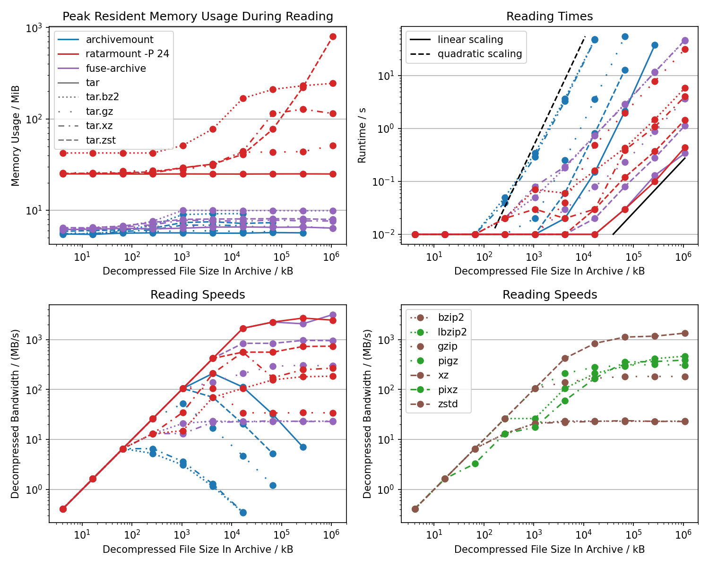

<div align="center">


# Random Access Tar Mount (Ratarmount)

[](https://pypi.org/project/ratarmount/)
[](https://badge.fury.io/py/ratarmount)
[](https://pepy.tech/project/ratarmount)
[](https://anaconda.org/conda-forge/ratarmount)
</br>
[](https://github.com/mxmlnkn/ratarmount/blob/master/CHANGELOG.md)
[](http://opensource.org/licenses/MIT)
[](https://github.com/mxmlnkn/ratarmount/actions)
[](https://discord.gg/Wra6t6akh2)
[](https://t.me/joinchat/FUdXxkXIv6c4Ib8bgaSxNg)

</div>

Ratarmount collects all file positions inside a TAR so that it can easily jump to and read from any file without extracting it.
It, then, **mounts** the **TAR** using [fusepy](https://github.com/fusepy/fusepy) for read access just like [archivemount](https://github.com/cybernoid/archivemount/).
In [contrast](https://github.com/libarchive/libarchive#notes-about-the-library-design) to [libarchive](https://github.com/libarchive/libarchive), on which archivemount is based, random access and true seeking is supported.
And in contrast to [tarindexer](https://github.com/devsnd/tarindexer), which also collects file positions for random access, ratarmount offers easy access via FUSE and support for compressed TARs.

*Capabilities:*

 - **Highly Parallelized:** By default, all cores are used for parallelized algorithms like for the gzip, bzip2, and xz decoders.
   This can yield huge speedups on most modern processors but requires more main memory.
   It can be controlled or completely turned off using the `-P <cores>` option.
 - **Recursive Mounting:** Ratarmount will also mount TARs inside TARs inside TARs, ... recursively into folders of the same name, which is useful for the 1.31TB ImageNet data set.
 - **Mount Compressed Files:** You may also mount files with one of the supported compression schemes.
   Even if these files do not contain a TAR, you can leverage ratarmount's true seeking capabilities when opening the mounted uncompressed view of such a file.
 - **Read-Only Bind Mounting:** Folders may be mounted read-only to other folders for usecases like merging a backup TAR with newer versions of those files residing in a normal folder.
 - **Union Mounting:** Multiple TARs, compressed files, and bind mounted folders can be mounted under the same mountpoint.
 - **Write Overlay:** A folder can be specified as write overlay.
   All changes below the mountpoint will be redirected to this folder and deletions are tracked so that all changes can be applied back to the archive.

*TAR compressions supported for random access:*

 - **BZip2** as provided by [indexed_bzip2](https://github.com/mxmlnkn/indexed_bzip2) as a backend, which is a refactored and extended version of [bzcat](https://github.com/landley/toybox/blob/c77b66455762f42bb824c1aa8cc60e7f4d44bdab/toys/other/bzcat.c) from [toybox](https://landley.net/code/toybox/). See also the [reverse engineered specification](https://github.com/dsnet/compress/blob/master/doc/bzip2-format.pdf).
 - **Gzip** and **Zlib** as provided by [rapidgzip](https://github.com/mxmlnkn/rapidgzip) or [indexed_gzip](https://github.com/pauldmccarthy/indexed_gzip) by Paul McCarthy. See also [RFC1952](https://tools.ietf.org/html/rfc1952) and [RFC1950](https://tools.ietf.org/html/rfc1950).
 - **Xz** as provided by [python-xz](https://github.com/Rogdham/python-xz) by Rogdham or [lzmaffi](https://github.com/r3m0t/backports.lzma) by Tomer Chachamu. See also [The .xz File Format](https://tukaani.org/xz/xz-file-format.txt).
 - **Zstd** as provided by [indexed_zstd](https://github.com/martinellimarco/indexed_zstd) by Marco Martinelli. See also [Zstandard Compression Format](https://github.com/facebook/zstd/blob/master/doc/zstd_compression_format.md).

*Other supported archive formats:*

 - **Rar** as provided by [rarfile](https://github.com/markokr/rarfile) by Marko Kreen. See also the [RAR 5.0 archive format](https://www.rarlab.com/technote.htm).
 - **Zip** as provided by [zipfile](https://docs.python.org/3/library/zipfile.html), which is distributed with Python itself. See also the [ZIP File Format Specification](https://pkware.cachefly.net/webdocs/casestudies/APPNOTE.TXT).
 - **Many Others** as provided by [libarchive](https://github.com/libarchive/libarchive) via  [python-libarchive-c](https://github.com/Changaco/python-libarchive-c).
   - Formats with tests:
     [7z](https://github.com/ip7z/7zip/blob/main/DOC/7zFormat.txt),
     ar,
     [cab](https://download.microsoft.com/download/4/d/a/4da14f27-b4ef-4170-a6e6-5b1ef85b1baa/[ms-cab].pdf),
     compress, cpio,
     [iso](http://www.brankin.com/main/technotes/Notes_ISO9660.htm),
     [lrzip](https://github.com/ckolivas/lrzip),
     [lzma](https://www.7-zip.org/a/lzma-specification.7z),
     [lz4](https://github.com/lz4/lz4/blob/dev/doc/lz4_Frame_format.md),
     [lzip](https://www.ietf.org/archive/id/draft-diaz-lzip-09.txt),
     lzo,
     [warc](https://iipc.github.io/warc-specifications/specifications/warc-format/warc-1.0/),
     xar.
   - Untested formats that might work or not: deb, grzip,
     [rpm](https://refspecs.linuxbase.org/LSB_4.1.0/LSB-Core-generic/LSB-Core-generic/pkgformat.html),
     [uuencoding](https://en.wikipedia.org/wiki/Uuencoding).
   - Beware that libarchive has no performant random access to files and to file contents.
     In order to seek or open a file, in general, it needs to be assumed that the archive has to be parsed from the beginning.
     If you have a performance-critical use case for a format only supported via libarchive,
     then please open a feature request for a faster customized archive format implementation.
     The hope would be to add suitable stream compressors such as "short"-distance LZ-based compressions to [rapidgzip](https://github.com/mxmlnkn/rapidgzip).


# Table of Contents

1. [Installation](#installation)
   1. [Installation via AppImage](#installation-via-appimage)
   2. [Installation via Package Manager](#installation-via-package-manager)
      1. [Arch Linux](#arch-linux)
   3. [System Dependencies for PIP Installation (Rarely Necessary)](#system-dependencies-for-pip-installation-rarely-necessary)
   4. [PIP Package Installation](#pip-package-installation)
2. [Benchmarks](#benchmarks)
3. [The Problem](#the-problem)
4. [The Solution](#the-solution)
5. [Usage](#usage)
   1. [Metadata Index Cache](#metadata-index-cache)
   2. [Bind Mounting](#bind-mounting)
   3. [Union Mounting](#union-mounting)
   4. [File versions](#file-versions)
   5. [Compressed non-TAR files](#compressed-non-tar-files)
   6. [Xz and Zst Files](#xz-and-zst-files)
   7. [As a Library](#as-a-library)


# Installation

You can install ratarmount either by simply downloading the [AppImage](https://github.com/mxmlnkn/ratarmount/releases) or via pip.
The latter might require [installing additional dependencies](#system-dependencies-for-pip-installation-rarely-necessary).

```bash
pip install ratarmount
```

## Installation via AppImage

The [AppImage](https://appimage.org/) files are attached under "Assets" on the [releases page](https://github.com/mxmlnkn/ratarmount/releases).
They require no installation and can be simply executed like a portable executable.
If you want to install it, you can simply copy it into any of the folders listed in your `PATH`.

```bash
appImageName=ratarmount-0.14.2-x86_64.AppImage
wget 'https://github.com/mxmlnkn/ratarmount/releases/download/v0.14.2/$appImageName'
chmod u+x -- "$appImageName"
./"$appImageName" --help  # Simple test run
sudo cp -- "$appImageName" /usr/local/bin/ratarmount  # Example installation
```

## Installation via Package Manager

[](https://repology.org/project/ratarmount/versions)

### Arch Linux

Arch Linux's AUR offers ratarmount as [stable](https://aur.archlinux.org/packages/ratarmount) and [development](https://aur.archlinux.org/packages/ratarmount-git) package.
Use an [AUR helper](https://wiki.archlinux.org/title/AUR_helpers), like [yay](https://github.com/Jguer/yay) or [paru](https://github.com/Morganamilo/paru), to install one of them:

```console
# stable version
paru -Syu ratarmount
# development version
paru -Syu ratarmount-git
```

### Conda

```bash
conda install -c conda-forge ratarmount
```


## System Dependencies for PIP Installation (Rarely Necessary)

Python 3.6+, preferably pip 19.0+, FUSE, and sqlite3 are required.
These should be preinstalled on most systems.

On Debian-like systems like Ubuntu, you can install/update all dependencies using:

```bash
sudo apt install python3 python3-pip fuse sqlite3 unar
```

On macOS, you have to install [macFUSE](https://osxfuse.github.io/) with:

```bash
brew install macfuse
```

If you are installing on a system for which there exists no manylinux wheel, then you'll have to install further dependencies that are required to build some of the Python packages that ratarmount depends on from source:

```bash
sudo apt install \
    python3 python3-pip fuse \
    build-essential software-properties-common \
    zlib1g-dev libzstd-dev liblzma-dev cffi libarchive-dev
```

## PIP Package Installation

Then, you can simply install ratarmount from PyPI:
```bash
pip install ratarmount
```

Or, if you want to test the latest version:
```bash
python3 -m pip install --user --force-reinstall \
    'git+https://github.com/mxmlnkn/ratarmount.git@develop#egginfo=ratarmountcore&subdirectory=core' \
    'git+https://github.com/mxmlnkn/ratarmount.git@develop#egginfo=ratarmount'
```

If there are troubles with the compression backend dependencies, you can try the pip `--no-deps` argument.
Ratarmount will work without the compression backends.
The hard requirements are `fusepy` and for Python versions older than 3.7.0 `dataclasses`.


# Benchmarks


 - Not shown in the benchmarks, but ratarmount can mount files with **preexisting index sidecar files** in under a second making it **vastly more efficient** compared to archivemount for every **subsequent mount**.
   Also, archivemount has no progress indicator making it very unlikely the user will wait hours for the mounting to finish.
   Fuse-archive, an iteration on archivemount, has the `--asyncprogress` option to give a progress indicator using the timestamp of a dummy file.
   Note that fuse-archive daemonizes instantly but the mount point will not be usable for a long time and everything trying to use it will hang until then when not using `--asyncprogress`!
 - **Getting file contents** of a mounted archive is generally **vastly faster** than archivemount and fuse-archive and does not increase with the archive size or file count resulting in the largest observed speedups to be around 5 orders of magnitude!
 - **Memory consumption** of ratarmount is mostly **less** than archivemount and mostly does not grow with the archive size.
   Not shown in the plots, but the memory usage will be much smaller when not specifying `-P 0`, i.e., when not parallelizing.
   The gzip backend grows linearly with the archive size because the data for seeking is thousands of times larger than the simple two 64-bit offsets required for bzip2.
   The memory usage of the zstd backend only seems humongous because it uses `mmap` to open.
   The memory used by `mmap` is not even counted as used memory when showing the memory usage with `free` or `htop`.
 - For empty files, mounting with ratarmount and archivemount does not seem be bounded by decompression nor I/O bandwidths but instead by the algorithm for creating the internal file index.
   This algorithm scales **linearly** for ratarmount and fuse-archive but seems to scale worse than even quadratically for archives containing more than 1M files when using archivemount.
   Ratarmount 0.10.0 improves upon earlier versions by batching SQLite insertions.
 - Mounting **bzip2** and **xz** archives has actually become **faster** than archivemount and fuse-archive with `ratarmount -P 0` on most modern processors because it actually uses more than one core for decoding those compressions. `indexed_bzip2` supports block **parallel decoding** since version 1.2.0.
 - **Gzip** compressed TAR files are two times slower than archivemount during first time mounting.
   It is not totally clear to me why that is because streaming the file contents after the archive being mounted is comparably fast, see the next benchmarks below.
   In order to have superior speeds for both of these, I am [experimenting](https://github.com/mxmlnkn/indexed_bzip2/tree/parallelgz) with a parallelized gzip decompressor like the prototype [pugz](https://github.com/Piezoid/pugz) offers for non-binary files only.
 - For the other cases, mounting times become roughly the same compared to archivemount for archives with 2M files in an approximately 100GB archive.
 - **Getting a lot of metadata** for archive contents as demonstrated by calling `find` on the mount point is an order of magnitude **slower** compared to archivemount. Because the C-based fuse-archive is even slower than ratarmount, the difference is very likely that archivemount uses the low-level FUSE interface while ratarmount and fuse-archive use the high-level FUSE interface.




 - Reading files from the archive with archivemount are scaling quadratically instead of linearly.
   This is because archivemount starts reading from the beginning of the archive for each requested I/O block.
   The block size depends on the program or operating system and should be in the order of 4 kiB.
   Meaning, the scaling is `O( (sizeOfFileToBeCopiedFromArchive / readChunkSize)^2 )`.
   Both, ratarmount and fuse-archive avoid this behavior.
   Because of this quadratic scaling, the average bandwidth with archivemount seems like it decreases with the file size.
 - Reading bz2 and xz are both an order of magnitude faster, as tested on my 12/24-core Ryzen 3900X, thanks to parallelization.
 - Memory is bounded in these tests for all programs but ratarmount is a lot more lax with memory because it uses a Python stack and because it needs to hold caches for a constant amount of blocks for parallel decoding of bzip2 and xz files.
   The zstd backend in ratarmount looks unbounded because it uses mmap, whose memory usage will automatically stop and be freed if the memory limit has been reached.
 - The peak for the xz decoder reading speeds happens because some blocks will be cached when loading the index, which is not included in the benchmark for technical reasons. The value for the 1 GiB file size is more realistic.


Further benchmarks can be viewed [here](benchmarks/BENCHMARKS.md).


# The Problem

You downloaded a large TAR file from the internet, for example the [1.31TB](http://academictorrents.com/details/564a77c1e1119da199ff32622a1609431b9f1c47) large [ImageNet](http://image-net.org/), and you now want to use it but lack the space, time, or a file system fast enough to extract all the 14.2 million image files.


<details>
<summary>Existing Partial Solutions</summary>

## Partial Solutions

### Archivemount

[Archivemount](https://github.com/cybernoid/archivemount/) seems to have large performance issues for too many files and large archive for both mounting and file access in version 0.8.7. A more in-depth comparison benchmark can be found [here](benchmarks/BENCHMARKS.md).

  - Mounting the 6.5GB ImageNet Large-Scale Visual Recognition Challenge 2012 validation data set, and then testing the speed with: `time cat mounted/ILSVRC2012_val_00049975.JPEG | wc -c` takes 250ms for archivemount and 2ms for ratarmount.
  - Trying to mount the 150GB [ILSVRC object localization data set](https://www.kaggle.com/c/imagenet-object-localization-challenge) containing 2 million images was given up upon after 2 hours. Ratarmount takes ~15min to create a ~150MB index and <1ms for opening an already created index (SQLite database) and mounting the TAR. In contrast, archivemount will take the same amount of time even for subsequent mounts.
  - Does not support recursive mounting. Although, you could write a script to stack archivemount on top of archivemount for all contained TAR files.

### Tarindexer

[Tarindex](https://github.com/devsnd/tarindexer) is a command line to tool written in Python which can create index files and then use the index file to extract single files from the tar fast. However, it also has some caveats which ratarmount tries to solve:

  - It only works with single files, meaning it would be necessary to loop over the extract-call. But this would require loading the possibly quite large tar index file into memory each time. For example for ImageNet, the resulting index file is hundreds of MB large. Also, extracting directories will be a hassle.
  - It's difficult to integrate tarindexer into other production environments. Ratarmount instead uses FUSE to mount the TAR as a folder readable by any other programs requiring access to the contained data.
  - Can't handle TARs recursively. In order to extract files inside a TAR which itself is inside a TAR, the packed TAR first needs to be extracted.


### TAR Browser

I didn't find out about [TAR Browser](https://github.com/tomorrow-nf/tar-as-filesystem/) before I finished the ratarmount script. That's also one of it's cons:

  - Hard to find. I don't seem to be the only one who has trouble finding it as it has one star on Github after 7 years compared to 45 stars for tarindexer after roughly the same amount of time.
  - Hassle to set up. Needs compilation and I gave up when I was instructed to set up a MySQL database for it to use. Confusingly, the setup instructions are not on its Github but [here](https://web.wpi.edu/Pubs/E-project/Available/E-project-030615-133259/unrestricted/TARBrowserFinal.pdf).
  - Doesn't seem to support recursive TAR mounting. I didn't test it because of the MysQL dependency but the code does not seem to have logic for recursive mounting.
  - Xz compression also is only block or frame based, i.e., only works faster with files created by [pixz](https://github.com/vasi/pixz) or [pxz](https://github.com/jnovy/pxz).

Pros:
  - supports bz2- and xz-compressed TAR archives

</details>

## The Solution

Ratarmount creates an index file with file names, ownership, permission flags, and offset information.
This sidecar is stored at the TAR file's location or in `~/.ratarmount/`.
Ratarmount can load that index file in under a second if it exists and then offers FUSE mount integration for easy access to the files inside the archive.

Here is a more recent test for version 0.2.0 with the new default SQLite backend:

  - TAR size: 124GB
  - Contains TARs: yes
  - Files in TAR: 1000
  - Files in TAR (including recursively in contained TARs): 1.26 million
  - Index creation (first mounting): 15m 39s
  - Index size: 146MB
  - Index loading (subsequent mounting): 0.000s
  - Reading a 64kB file: ~4ms
  - Running 'find mountPoint -type f | wc -l' (1.26M stat calls): 1m 50s

The reading time for a small file simply verifies the random access by using file seek to be working. The difference between the first read and subsequent reads is not because of ratarmount but because of operating system and file system caches.

<details>
<summary>Older test with 1.31 TB Imagenet (Fall 2011 release)</summary>

The test with the first version of ratarmount ([50e8dbb](https://github.com/mxmlnkn/ratarmount/commit/50e8dbb10696d51de2e613dee560662be580cbd4)), which used the, as of now removed, pickle backend for serializing the metadata index, for the [ImageNet data set](https://academictorrents.com/details/564a77c1e1119da199ff32622a1609431b9f1c47):

  - TAR size: 1.31TB
  - Contains TARs: yes
  - Files in TAR: ~26 000
  - Files in TAR (including recursively in contained TARs): 14.2 million
  - Index creation (first mounting): 4 hours
  - Index size: 1GB
  - Index loading (subsequent mounting): 80s
  - Reading a 40kB file: 100ms (first time) and 4ms (subsequent times)

Index loading is relatively slow with 80s because of the pickle backend, which now has been replaced with SQLite and should take less than a second now.

</details>


# Usage

## Command Line Options

See `ratarmount --help` or [here](https://raw.githubusercontent.com/mxmlnkn/ratarmount/master/tests/ratarmount-help.txt).

## Metadata Index Cache

In order to reduce the mounting time, the created index for random access
to files inside the tar will be saved to one of these locations. These
locations are checked in order and the first, which works sufficiently, will
be used. This is the default location order:

  1. <path to tar>.index.sqlite
  2. ~/.ratarmount/<path to tar: '/' -> '_'>.index.sqlite
     E.g., ~/.ratarmount/_media_cdrom_programm.tar.index.sqlite

This list of fallback folders can be overwritten using the `--index-folders`
option. Furthermore, an explicitly named index file may be specified using
the `--index-file` option. If `--index-file` is used, then the fallback
folders, including the default ones, will be ignored!

## Bind Mounting

The mount sources can be TARs and/or folders.  Because of that, ratarmount
can also be used to bind mount folders read-only to another path similar to
`bindfs` and `mount --bind`. So, for:

    ratarmount folder mountpoint

all files in `folder` will now be visible in mountpoint.

## Union Mounting

If multiple mount sources are specified, the sources on the right side will be
added to or update existing files from a mount source left of it. For example:

    ratarmount folder1 folder2 mountpoint

will make both, the files from folder1 and folder2, visible in mountpoint.
If a file exists in both multiple source, then the file from the rightmost
mount source will be used, which in the above example would be `folder2`.

If you want to update / overwrite a folder with the contents of a given TAR,
you can specify the folder both as a mount source and as the mount point:

    ratarmount folder file.tar folder

The FUSE option -o nonempty will be automatically added if such a usage is
detected. If you instead want to update a TAR with a folder, you only have to
swap the two mount sources:

    ratarmount file.tar folder folder

## File versions

If a file exists multiple times in a TAR or in multiple mount sources, then
the hidden versions can be accessed through special <file>.versions folders.
For example, consider:

    ratarmount folder updated.tar mountpoint

and the file `foo` exists both in the folder and as two different versions
in `updated.tar`. Then, you can list all three versions using:

    ls -la mountpoint/foo.versions/
        dr-xr-xr-x 2 user group     0 Apr 25 21:41 .
        dr-x------ 2 user group 10240 Apr 26 15:59 ..
        -r-x------ 2 user group   123 Apr 25 21:41 1
        -r-x------ 2 user group   256 Apr 25 21:53 2
        -r-x------ 2 user group  1024 Apr 25 22:13 3

In this example, the oldest version has only 123 bytes while the newest and
by default shown version has 1024 bytes. So, in order to look at the oldest
version, you can simply do:

    cat mountpoint/foo.versions/1

Note that these version numbers are the same as when used with tar's
`--occurrence=N` option.

## Prefix Removal

Use `ratarmount -o modules=subdir,subdir=<prefix>` to remove path prefixes
using the FUSE `subdir` module. Because it is a standard FUSE feature, the
`-o ...` argument should also work for other FUSE applications.

When mounting an archive created with absolute paths, e.g.,
`tar -P cf /var/log/apt/history.log`, you would see the whole `var/log/apt`
hierarchy under the mount point. To avoid that, specified prefixes can be
stripped from paths so that the mount target directory **directly** contains
`history.log`. Use `ratarmount -o modules=subdir,subdir=/var/log/apt/` to do
so. The specified path to the folder inside the TAR will be mounted to root,
i.e., the mount point.

## Compressed non-TAR files

If you want a compressed file not containing a TAR, e.g., `foo.bz2`, then
you can also use ratarmount for that. The uncompressed view will then be
mounted to `<mountpoint>/foo` and you will be able to leverage ratarmount's
seeking capabilities when opening that file.

## Xz and Zst Files

In contrast to bzip2 and gzip compressed files, true seeking on xz and zst files is only possible at block or frame boundaries.
This wouldn't be noteworthy, if both standard compressors for [xz](https://tukaani.org/xz/) and [zstd](https://github.com/facebook/zstd) were not by default creating unsuited files.
Even though both file formats do support multiple frames and xz even contains a frame table at the end for easy seeking, both compressors write only a single frame and/or block out, making this feature unusable.
In order to generate truly seekable compressed files, you'll have to use [pixz](https://github.com/vasi/pixz) for xz files.
For zstd compressed, you can try with [t2sz](https://github.com/martinellimarco/t2sz).
The standard zstd tool does not support setting smaller block sizes yet although an [issue](https://github.com/facebook/zstd/issues/2121) does exist.
Alternatively, you can simply split the original file into parts, compress those parts, and then concatenate those parts together to get a suitable multiframe zst file.
Here is a bash function, which can be used for that:

<details>
<summary>Bash script: createMultiFrameZstd</summary>

```bash
createMultiFrameZstd()
(
    # Detect being piped into
    if [ -t 0 ]; then
        file=$1
        frameSize=$2
        if [[ ! -f "$file" ]]; then echo "Could not find file '$file'." 1>&2; return 1; fi
        fileSize=$( stat -c %s -- "$file" )
    else
        if [ -t 1 ]; then echo 'You should pipe the output to somewhere!' 1>&2; return 1; fi
        echo 'Will compress from stdin...' 1>&2
        frameSize=$1
    fi
    if [[ ! $frameSize =~ ^[0-9]+$ ]]; then
        echo "Frame size '$frameSize' is not a valid number." 1>&2
        return 1
    fi

    # Create a temporary file. I avoid simply piping to zstd
    # because it wouldn't store the uncompressed size.
    if [[ -d /dev/shm ]]; then frameFile=$( mktemp --tmpdir=/dev/shm ); fi
    if [[ -z $frameFile ]]; then frameFile=$( mktemp ); fi
    if [[ -z $frameFile ]]; then
        echo "Could not create a temporary file for the frames." 1>&2
        return 1
    fi

    if [ -t 0 ]; then
        true > "$file.zst"
        for (( offset = 0; offset < fileSize; offset += frameSize )); do
            dd if="$file" of="$frameFile" bs=$(( 1024*1024 )) \
               iflag=skip_bytes,count_bytes skip="$offset" count="$frameSize" 2>/dev/null
            zstd -c -q -- "$frameFile" >> "$file.zst"
        done
    else
        while true; do
            dd of="$frameFile" bs=$(( 1024*1024 )) \
               iflag=count_bytes count="$frameSize" 2>/dev/null
            # pipe is finished when reading it yields no further data
            if [[ ! -s "$frameFile" ]]; then break; fi
            zstd -c -q -- "$frameFile"
        done
    fi

    'rm' -f -- "$frameFile"
)
```

In order to compress a file named `foo` into a multiframe zst file called `foo.zst`, which contains frames sized 4MiB of uncompressed ata, you would call it like this:

```bash
createMultiFrameZstd foo  $(( 4*1024*1024 ))
```

It also works when being piped to. This can be useful for recompressing files to avoid having to decompress them first to disk.

```bash
lbzip2 -cd well-compressed-file.bz2 | createMultiFrameZstd $(( 4*1024*1024 )) > recompressed.zst
```

</details>


# Writable Mounting

The  `--write-overlay <folder>` option can be used to create a writable mount point.
The original archive will not be modified.

 - File creations will create these files in the specified overlay folder.
 - File deletions and renames will be registered in a database that also resides in the overlay folder.
 - File modifications will copy the file from the archive into the overlay folder before applying the modification.

This overlay folder can be stored alongside the archive or it can be deleted after unmounting the archive.
This is useful when building the executable from a source tarball without extracting.
After installation, the intermediary build files residing in the overlay folder can be safely removed.

If it is desired to apply the modifications to the original archive, then the `--commit-overlay` can be prepended to the original ratarmount call.

Here is an example for applying modifications to a writable mount and then committing those modifications back to the archive:

 1. Mount it with a write overlay and add new files. The original archive is not modified.
    ```bash
    ratarmount --write-overlay example-overlay example.tar example-mount-point
    echo "Hello World" > example-mount-point/new-file.txt
    ```

 2. Unmount. Changes persist solely in the overlay folder.
    ```bash
    fusermount -u example-mount-point
    ```

 3. Commit changes to the original archive.
    ```bash
    ratarmount --commit-overlay --write-overlay example-overlay example.tar example-mount-point
    ```
    Output:
    ```bash
    To commit the overlay folder to the archive, these commands have to be executed:
    
        tar --delete --null --verbatim-files-from --files-from='/tmp/tmp_ajfo8wf/deletions.lst' \
            --file 'example.tar' 2>&1 |
           sed '/^tar: Exiting with failure/d; /^tar.*Not found in archive/d'
        tar --append -C 'zlib-wiki-overlay' --null --verbatim-files-from --files-from='/tmp/tmp_ajfo8wf/append.lst' --file 'example.tar'
    
    Committing is an experimental feature!
    Please confirm by entering "commit". Any other input will cancel.
    > 
    Committed successfully. You can now remove the overlay folder at example-overlay.
    ```

 4. Verify the modifications to the original archive.
    ```bash
    tar -tvlf example.tar
    ```
    Output:
    ```
    -rw-rw-r-- user/user 652817 2022-08-08 10:44 example.txt
    -rw-rw-r-- user/user     12 2023-02-16 09:49 new-file.txt
    ```

 5. Remove the obsole write overlay folder.
    ```bash
    rm -r example-overlay
    ```

## As a Library

Ratarmount can also be used as a library.
Using [ratarmountcore](core/), files inside archives can be accessed directly from Python code without requiring FUSE.
For a more detailed description, see the [ratarmountcore readme here](core/).
