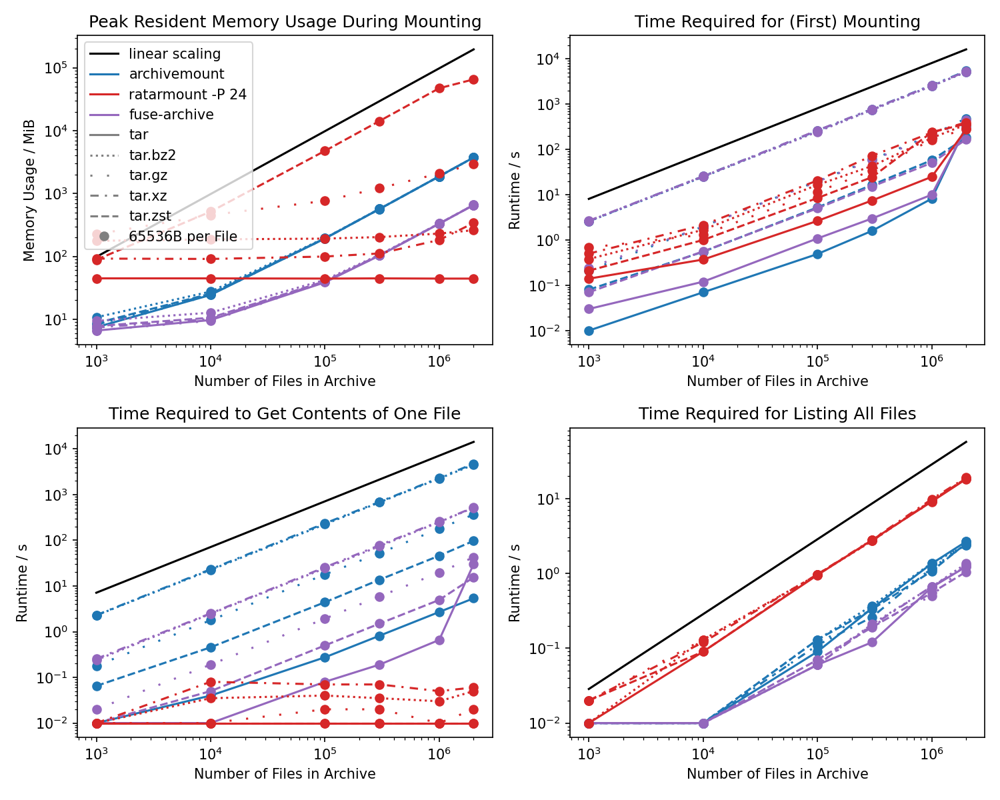

# Random Access Read-Only Tar Mount (Ratarmount)

[](https://badge.fury.io/py/ratarmount)
[](https://pepy.tech/project/ratarmount/month)
[](http://opensource.org/licenses/MIT)
[](https://travis-ci.com/mxmlnkn/ratarmount)

Combines the random access indexing idea from [tarindexer](https://github.com/devsnd/tarindexer) and then **mounts** the **TAR** using [fusepy](https://github.com/fusepy/fusepy) for easy read-only access just like [archivemount](https://github.com/cybernoid/archivemount/).
It also will mount TARs inside TARs inside TARs, ... **recursively** into folders of the same name, which is useful for the ImageNet data set.
Furthermore, it now has support for **BZip2** compressed TAR archives provided by [indexed_bzip2](https://github.com/mxmlnkn/indexed_bzip2), a refactored and extended version of [bzcat](https://github.com/landley/toybox/blob/c77b66455762f42bb824c1aa8cc60e7f4d44bdab/toys/other/bzcat.c) from [toybox](https://landley.net/code/toybox/), and support for **Gzip** compressed TAR archives provided by the [indexed_gzip](https://github.com/pauldmccarthy/indexed_gzip) dependency.


# Table of Contents
1. [Installation](#installation)
2. [Usage](#usage)
3. [The Problem](#the-problem)
4. [The Solution](#the-solution)
5. [Benchmarks](benchmarks/BENCHMARKS.md)

# Installation

You can simply install it from PyPI:
```
pip install ratarmount
```

Or, if you want to test the latest development version on a Debian-like system:
```bash
sudo apt-get update
sudo apt-get install python3 python3-pip git
git clone https://github.com/mxmlnkn/ratarmount.git
python3 -m pip install --user .
ratarmount --help
```

You can also simply download [ratarmount.py](https://github.com/mxmlnkn/ratarmount/raw/master/ratarmount.py) and call it directly after installing the dependencies manually with: `pip3 install --user fusepy indexed_bzip2`.

If you want to use other serialization backends instead of the default SQLite one, e.g., because you still have indexes lying around created with those backends and don't want to spend time recreating them, then you'll have to install a version older than 0.5.0 with the optional `legacy-serializers` feature:

```
pip install ratarmount[legacy-serializers]==0.4.1
```

# Usage

```
usage: ratarmount.py [-h] [-f] [-d DEBUG] [-c] [-r]
                     [-gs GZIP_SEEK_POINT_SPACING] [-p PREFIX] [-o FUSE] [-v]
                     mount_source [mount_source ...] [mount_point]

With ratarmount, you can:
  - Mount a TAR file to a folder for read-only access
  - Bind mount a folder to another folder for read-only access
  - Union mount a list of TARs and folders to a folder for read-only access

positional arguments:
  mount_source          The path to the TAR archive to be mounted. If multiple
                        archives and/or folders are specified, then they will
                        be mounted as if the arguments coming first were
                        updated with the contents of the archives or folders
                        specified thereafter, i.e., the list of TARs and
                        folders will be union mounted.
  mount_point           The path to a folder to mount the TAR contents into.
                        If no mount path is specified, the TAR will be mounted
                        to a folder of the same name but without a file
                        extension. (default: None)

optional arguments:
  -h, --help            show this help message and exit
  -f, --foreground      Keeps the python program in foreground so it can print
                        debug output when the mounted path is accessed.
                        (default: False)
  -d DEBUG, --debug DEBUG
                        Sets the debugging level. Higher means more output.
                        Currently, 3 is the highest. (default: 1)
  -c, --recreate-index  If specified, pre-existing .index files will be
                        deleted and newly created. (default: False)
  -r, --recursive       Mount TAR archives inside the mounted TAR recursively.
                        Note that this only has an effect when creating an
                        index. If an index already exists, then this option
                        will be effectively ignored. Recreate the index if you
                        want change the recursive mounting policy anyways.
                        (default: False)
  -gs GZIP_SEEK_POINT_SPACING, --gzip-seek-point-spacing GZIP_SEEK_POINT_SPACING
                        This only is applied when the index is first created
                        or recreated with the -c option. The spacing given in
                        MiB specifies the seek point distance in the
                        uncompressed data. A distance of 16MiB means that
                        archives smaller than 16MiB in uncompressed size will
                        not benefit from faster seek times. A seek point takes
                        roughly 32kiB. So, smaller distances lead to more
                        responsive seeking but may explode the index size!
                        (default: 16)
  -p PREFIX, --prefix PREFIX
                        [deprecated] Use "-o modules=subdir,subdir=<prefix>"
                        instead. This standard way utilizes FUSE itself and
                        will also work for other FUSE applications. So, it is
                        preferable even if a bit more verbose.The specified
                        path to the folder inside the TAR will be mounted to
                        root. This can be useful when the archive as created
                        with absolute paths. E.g., for an archive created with
                        `tar -P cf /var/log/apt/history.log`, -p /var/log/apt/
                        can be specified so that the mount target directory
                        >directly< contains history.log. (default: )
  -o FUSE, --fuse FUSE  Comma separated FUSE options. See "man mount.fuse" for
                        help. Example: --fuse
                        "allow_other,entry_timeout=2.8,gid=0". (default: )
  -v, --version         Print version string. (default: False)

# Metadata Index Cache

In order to reduce the mounting time, the created index for random access
to files inside the tar will be saved to these locations in order. A lower
location will only be used if all upper locations can't be written to.

    1. <path to tar>.index.sqlite
    2. ~/.ratarmount/<path to tar: '/' -> '_'>.index.sqlite
       E.g., ~/.ratarmount/_media_cdrom_programm.tar.index.sqlite

# Bind Mounting

The mount sources can be TARs and/or folders.  Because of that, ratarmount
can also be used to bind mount folders read-only to another path similar to
"bindfs" and "mount --bind". So, for:
    ratarmount folder mountpoint
all files in folder will now be visible in mountpoint.

# Union Mounting

If multiple mount sources are specified, the sources on the right side will be
added to or update existing files from a mount source left of it. For example:
    ratarmount folder1 folder2 mountpoint
will make both, the files from folder1 and folder2, visible in mountpoint.
If a file exists in both multiple source, then the file from the rightmost
mount source will be used, which in the above example would be "folder2".

If you want to update / overwrite a folder with the contents of a given TAR,
you can specify the folder both as a mount source and as the mount point:
    ratarmount folder file.tar folder
The FUSE option -o nonempty will be automatically added if such a usage is
detected. If you instead want to update a TAR with a folder, you only have to
swap the two mount sources:
    ratarmount file.tar folder folder

# File versions

If a file exists multiple times in a TAR or in multiple mount sources, then
the hidden versions can be accessed through special <file>.versions folders.
For example, consider:
    ratarmount folder updated.tar mountpoint
and the file "foo" exists both in the folder and in two different versions
in "updated.tar". Then, you can list all three versions using:
    ls -la mountpoint/foo.versions/
        dr-xr-xr-x 2 user group     0 Apr 25 21:41 .
        dr-x------ 2 user group 10240 Apr 26 15:59 ..
        -r-x------ 2 user group   123 Apr 25 21:41 1
        -r-x------ 2 user group   256 Apr 25 21:53 2
        -r-x------ 2 user group  1024 Apr 25 22:13 3
In this example, the oldest version has only 123 bytes while the newest and
by default shown version has 1024 bytes. So, in order to look at the oldest
version, you can simply do:
    cat mountpoint/foo.versions/1
```


# The Problem

You downloaded a large TAR file from the internet, for example the [1.31TB](http://academictorrents.com/details/564a77c1e1119da199ff32622a1609431b9f1c47) large [ImageNet](http://image-net.org/), and you now want to use it but lack the space, time, or a file system fast enough to extract all the 14.2 million image files.


## Partial Solutions

### Archivemount

[Archivemount](https://github.com/cybernoid/archivemount/) seems to have large performance issues for too many files for both mounting and file access in version 0.8.7. A more in-depth comparison benchmark can be found [here](benchmarks/BENCHMARKS.md).

  - Mounting the 6.5GB ImageNet Large-Scale Visual Recognition Challenge 2012 validation data set, and then testing the speed with: `time cat mounted/ILSVRC2012_val_00049975.JPEG | wc -c` takes 250ms for archivemount and 2ms for ratarmount.
  - Trying to mount the 150GB [ILSVRC object localization data set](https://www.kaggle.com/c/imagenet-object-localization-challenge) containing 2 million images was given up upon after 2 hours. Ratarmount takes ~15min to create a ~150MB index and <1ms for opening an already created index (SQLite database) and mounting the TAR. In contrast, archivemount will take the same amount of time even for subsequent mounts.
  - Does not support recursive mounting. Although, you could write a script to stack archivemount on top of archivemount for all contained TAR files.

### Tarindexer

[Tarindex](https://github.com/devsnd/tarindexer) is a command line to tool written in Python which can create index files and then use the index file to extract single files from the tar fast. However, it also has some caveats which ratarmount tries to solve:

  - It only works with single files, meaning it would be necessary to loop over the extract-call. But this would require loading the possibly quite large tar index file into memory each time. For example for ImageNet, the resulting index file is hundreds of MB large. Also, extracting directories will be a hassle.
  - It's difficult to integrate tarindexer into other production environments. Ratarmount instead uses FUSE to mount the TAR as a folder readable by any other programs requiring access to the contained data.
  - Can't handle TARs recursively. In order to extract files inside a TAR which itself is inside a TAR, the packed TAR first needs to be extracted.


### TAR Browser

I didn't find out about [TAR Browser](https://github.com/tomorrow-nf/tar-as-filesystem/) before I finished the ratarmount script. That's also one of it's cons:

  - Hard to find. I don't seem to be the only one who has trouble finding it as it has zero stars on Github after 4 years compared to 29 stars for tarindexer after roughly the same amount of time.
  - Hassle to set up. Needs compilation and I gave up when I was instructed to set up a MySQL database for it to use. Confusingly, the setup instructions are not on its Github but [here](https://web.wpi.edu/Pubs/E-project/Available/E-project-030615-133259/unrestricted/TARBrowserFinal.pdf).
  - Doesn't seem to support recursive TAR mounting. I didn't test it because of the MysQL dependency but the code does not seem to have logic for recursive mounting.

Pros:
  - supports bz2- and xz-compressed TAR archives


## The Solution

Ratarmount creates an index file with file names, ownership, permission flags, and offset information to be stored at the TAR file's location or inside `~/.ratarmount/` and then offers a FUSE mount integration for easy access to the files.

The test with the first version (50e8dbb), which used the removed pickle backend for serializing the metadata index, for the ImageNet data set is promising:

  - TAR size: 1.31TB
  - Contains TARs: yes
  - Files in TAR: ~26 000
  - Files in TAR (including recursively in contained TARs): 14.2 million
  - Index creation (first mounting): 4 hours
  - Index size: 1GB
  - Index loading (subsequent mounting): 80s
  - Reading a 40kB file: 100ms (first time) and 4ms (subsequent times)

The reading time for a small file simply verifies the random access by using file seek to be working. The difference between the first read and subsequent reads is not because of ratarmount but because of operating system and file system caches.

Here is a more recent test for version 0.2.0 with the new default SQLite backend:

  - TAR size: 124GB
  - Contains TARs: yes
  - Files in TAR: 1000
  - Files in TAR (including recursively in contained TARs): 1.26 million
  - Index creation (first mounting): 15m 39s
  - Index size: 146MB
  - Index loading (subsequent mounting): 0.000s
  - Reading a 64kB file: ~4ms
  - Running 'find mountPoint -type f | wc -l' (1.26M stat calls): 1m 50s

## Benchmarks

During the making of this project several benchmarks were created. These can be viewed [here](benchmarks/BENCHMARKS.md).
These are some of the things benchmarked and compared there:

  - Memory and runtime comparisons of backends for saving the index with offsets
  - Comparison of SQLite table designs
  - Mounting and file access time comparison between archivemount and ratarmount


