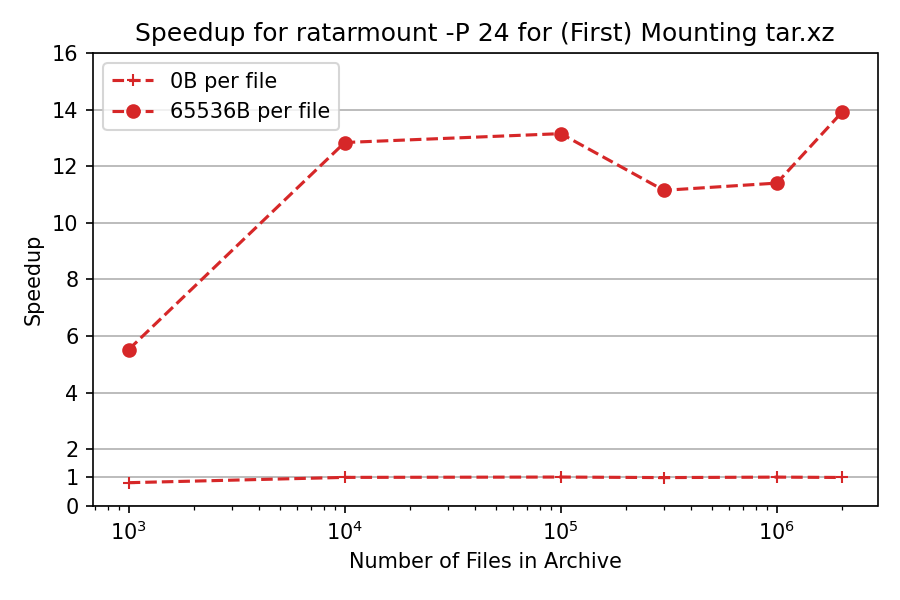
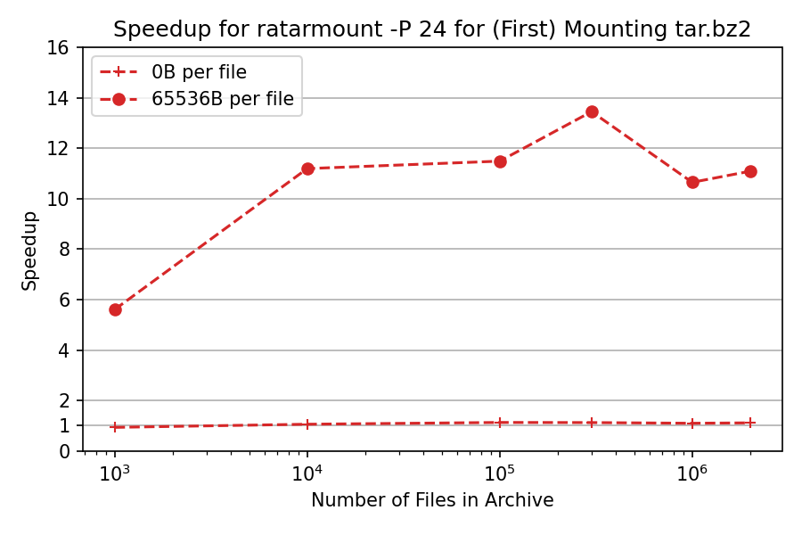

# Table of Contents

1. [Comparison with Archivemount and Fuse-archive (December 2021)](#comparison-with-archivemount-and-fuse-archive-december-2021)
1. [Speedup for Readdir Returning File Attributes](#speedup-for-readdir-returning-file-attributes)
1. [Parallel XZ Decoder Speedup](#parallel-xz-decoder-speedup)
1. [Parallel Indexing](#parallel-indexing)
1. [Comparison with Archivemount (June 2021)](#comparison-with-archivemount-june-2021)
1. [Parallel Bzip2 Decoder Speedup](#parallel-bzip2-decoder-speedup)
1. [Comparison with Archivemount (December 2019)](#comparison-with-archivemount-december-2019)
1. [Benchmarks for the Index File Serialization Backends](#benchmarks-for-the-index-file-serialization-backends)
1. [Comparison of SQLite Table Designs](#comparison-of-sqlite-table-designs)


# Comparison with Archivemount and Fuse-archive (December 2021)

Since the last comparison benchmark, fuse-archive and a benchmark for xz based on python-xz was added.
This makes the plot a bit crowded so that I removed the error bars for file access time and simply used the median but also adjusted the benchmark to create the archive the `--sort=name`, which should make the file access times more stable between different runs.
Furthermore, since the last benchmark, the performance for `find` could be improved upon by implementing the FUSE `readdir` alternative interface, which returns attributes for each file instead of just the names.

Xz support already existed at the time of the last benchmark but it had runaway memory usage, which got fixed in python-xz 0.4.0.
And the lzmaffi backend caused problems with installing on systems because the cffi dependency has to be installed beforehand manually and there are also no wheels.
This is why it was a more experimental feature.
But now it is more polished and even has been parallized, see the [next section](#parallel-xz-decoder-speedup).


# Speedup for Readdir Returning File Attributes


One major and rather simple performance improvement in ratarmount 0.10.0 is for speeding up `find` performance by returning not just the file names for FUSE `readdir` calls but also file attributes.
Previously, find had to stat each file in a folder even to just know which are files and which are folders to iterate further into.
But now, the `readdir` call for listing file contents already returns all `stat` information and therefore can reduce the number of FUSE callbacks by the number of files in each folder.

Further improvements to close the distance to archivemount performance in this might be possible by using the more difficult to use low-level FUSE interface.
But for ratarmount, this might not help much because the low-level API is based on inodes but if the conversion between inode and name is so complex that it also requires a map, then it might be similarly slow as the high-level interface and might even result in runaway memory usage.
And for ratarmount with union mounting and recursive mounting and even bind mounting of folders whose contents might change, it **is** difficult to find a fast inode mapping.
For simply TAR mounts, it might be possible and performance improving by using the SQLite row index as inode.


# Parallel XZ Decoder Speedup



When using all 24 logical cores (12 physical cores) for the parallel xz decoder based ontop of python-xz, the speedup tops out at roughly 10 but drops to 8 for very large archives, which is still a significant improvement upon the serial version.

Note that the boundary case of empty files inside the TAR, does not benefit from this because decompression is not the bottleneck but instead creating the SQLite index is.

In general, the parallelization is quite trivial over the xz blocks but there might be issues reducing the parallel efficiency like I/O access becoming more random instead of sequential or caches being thrashed.

Xz decompression has been parallized using a simple scheme in ratarmountcore ontop of python-xz:

 - For each thread in a thread pool:
   1. Seek to the specified block in constant time thanks to python-xz.
   2. Decode the block.
   3. Put the decoded contents into the block cache.
 - for the main thread:
   1. Submit block to thread pool if not found in cache.
   2. Get the requested block from the cache.
   3. Get result from future and return it.

Note that this heavily depends on fast seeking and therefore won't work for single-frame xz archives as created by default.
Instead, it requires xz-files, e.g., as created with `xz -T0` or with `pixz`.


# Parallel Indexing


Ratarmountcore 0.2.0 has been refactored to support traversing uncompressed TAR files in parallel in order to speed up SQLite index creation.
For this, each thread seeks to a TAR file boundary and starts collecting file metadata from there until a defined end point.

In order for this to improve speed, we need to find file boundaries faster than each thread does.
This can be done by simply iterating over the TAR raw, i.e., read the file size from the TAR header and jump over the file contents.
This scheme is 30x faster than iterating over the files using tarfile!
However, it also adds complexity and potential for bugs when accounting for TAR file metadata stored in previous blocks like for very long TAR file names.

Furthermore, as the chart above shows, the speedup is very unstable, probably because of the increased random I/O accesses.
For the boundary case of empty files, it can speed up indexing by factor 5 but for very large archives even with relatively small 64kiB files, it might result in 3 times slower indexing!

For these two reasons, this feature is still commented out in ratarmountcore 0.2.0 so that not even `-P 0` will activate it.

A possibly remedy might be to order I/O access by reading the TAR headers only and distributing that to the workers instead of having each worker open the archive file and seeking inside it.
Also, heuristics could be added to only use the parallelized indexing when there are a lot of **very** small files.


# Comparison with Archivemount (June 2021)

Since the last comparison benchmark, the zstd compression backend was added and `indexed_bzip2` was parallelized using threads.

To reduce the clutter, in the plot, the benchmarks with a file size of `64B` have been removed because they behave virtually the same as the `0B` per file case because `64B` of file contents are minuscule compared to 20x512B blocks per record per default.


## Conclusions

Only new observations are mentioned here. The other ones can be read in the older benchmark evaluation below.

The zstd backend, shows a huge memory overhead but that is only because it uses `mmap` to open the archive.
The memory used for memory-mapping the archive can be allocated by other processes if necessary and is not counted as used memory.
That's also why it tops out at 50GiB out of the available 62.8GiB physical memory and still works without being killed by the OOM-killer.
Old memory-mapped parts of the file will be freed automatically when further memory is needed.

The mount time for `0B` files inside the TAR is mainly bounded by I/O for reading the TAR and by the overhead of inserting those file information into the SQLite database.
That's why for, both, ratarmount and archivemount, the mount time for `0B` files does not vary much between the different compression backends.

Archivemount, and in other benchmarks also ratarmount, has a sudden slowdown for larger files for uncompressed TAR files.
And it even becomes slightly slower than the zstd compressed TAR.
This might be because the compressed archives are all roughly 20% smaller.
Therefore, I suspect I/O issues of some kind.
E.g., my TLC Crucial MX500 1TB SSD has an SLC-cache whose capacity might be exceeded
In the benchmark from over a year ago, I didn't observe such a thing.
Maybe because the SSD had more free space back then.

Mount time with zstd is roughly the same between archivemount and ratarmount and in general the fastest of all compared.

Because of the parallelized `indexed_bzip2` backend, the mount time for .tar.bz2 files could be reduced by roughly factor 12 on my Ryzen 3900X with 12 physical and 24 logical cores.
Because the parallelization is over blocks, the memory usage for the bz2 backend went up because at least as many bz2 blocks as there is parallelization (24 for these tests) must be hold in memory after prefetching.
To improve the speed, this is in general even more than that.
The memory usage is bounded by the maximum block cache size and maximum prefetch size but it might vary because of compression ratios of the blocks itself!
In the benchmarks, it seems to top out at roughly 200 MiB.
This shows how important more RAM is to make good use of processors with a lot of cores!

In my biased opinion, bzip2 compressed TAR files are now the best contender after uncompressed TAR files when using ratarmount.
However, the parallelization introduced further complexities, which I tried to keep in check by adding more sanitizers and tests to the CI, but as of now, I advise caution when using ratarmount with bz2 files!
Because of that, the default for ratarmount is to not use the parallelized version.
It has to be explicitly enabled with `-P 0`.


# Parallel Bzip2 Decoder Speedup



When using all 24 logical cores for the parallel bz2 decoder in `indexed_bzip2`, the speedup tops out at roughly 12, which seems to coincide with my physical cores.
However, with only `-P 12`, the speedup will be much smaller than 12! The latter is not shown here but was observed manually.

In general, the parallelization is quite trivial over the bz2 blocks but there might be issues reducing the parallel efficiency like I/O access becoming more random instead of sequential or caches being thrashed.


# Comparison with Archivemount (December 2019)

Here is a benchmark of memory footprint and required time for first mounting, as well as access times for a simple `cat <file-in-tar>` command and a simple `find` command.


Folders containing each 1k files were created and the number of folders is varied.

The lower left plot shows error bars indicating the minimum and maximum measured times for `cat <file>` for 10 randomly chosen files.

## File seek time

The killer comparison is the time it takes for `cat <file>` to finish.
For some reason, this scales linearly with the TAR file size (approx. bytes per file x number of files) for archivemount while being of constant time in ratarmount.
This makes it look like archivemount does not even support seeking at all.

For compressed TAR files, this is especially noticeable.
`cat <file>` takes more than twice as long as mounting the whole .tar.bz2 file!
For example, the TAR with 10k empty(!) files takes 2.9s to mount with archivemount but depending on the file which is accessed, the access with `cat` takes between 3ms and 5s.
The time it takes seems to depend on the position of the file inside the TAR.
Files at the end of the TAR take longer to seek to; indicating that the "seek" is emulated and all the contents in the TAR before the file are being read.

That getting the file contents can take more than twice as much time as mounting the whole TAR is unexpected in on itself.
At least, it should finish in the same amount of time as mounting.
One explanation would be that the file is being emulatedly seeked to more than once, maybe even thrice.

Ratarmount seemingly takes always the same amount of time to get a file because it supports true seeking.
For bzip2 compressed TARs, it even seeks to the bzip2 block, whose addresses are also stored in the index file.
Theoretically, the only part which should scale with the number of files is the lookup in the index and that should scale with O(log(n)) because it is sorted by file path and name.

## Memory footprint

In general, if you have more than 20k files inside the TAR, then the memory footprint of ratarmount will be smaller because the index is written to disk as it is created and therefore has a constant memory footprint of roughly 30MB on my system.

A small exception is the gzip decoder backend, which for some reason requires more memories as the gzip gets larger.
This memory overhead might be the index required for seeking inside the TAR but further investigation is needed as I did not write that backend.

In contrast, archivemount keeps the whole index, which is, e.g., 4GB for 2M files, completely in memory for as long as the TAR is mounted.

## Mounting time

My favorite feature is ratarmount being able to mount the TAR without noticeably delay on any subsequent try.
This is because the index, which maps filenames to metadata and the position inside the TAR, is written to an index file created next to the TAR file.

The required time for mounting behaves kinda weird in archivemount.
Starting from roughly 20k files it begins to scale quadratically instead of linearly with respect to the number of files.
This means that starting from roughly 4M files, ratarmount begins to be much faster than archivemount even though for smaller TAR files it's up to 10 times slower!
Then again, for smaller files, it does not matter much whether it takes 1s or 0.1s to mount the tar (the first time).

The mounting times for bz2 compressed files are the most comparable at all times.
This is very likely because it is bound by the speed of the bz2 decoder.
Ratarmount is roughly 2x slower here.
I hope to make ratarmount the clear winner by parallelizing the bz2 decoder in the near future, which even for my 8-year-old system could yield a 4x speedup.

## Time to get metadata

When simply listing all files with `find` inside the TAR (find also seems to call stat for each file!?), ratarmount is 10x slower than archivemount for all tested cases.
I hope to improve upon this in the future.
But currently, it looks like a design problem because of using Python and SQLite instead of a pure C program.


# Benchmarks for the Index File Serialization Backends

For most conventional TAR files, which have less than than 10k files, the choice of the serialization backend does not matter.
However, for larger TARs, both the runtime and the memory footprint can become limiting factors.
For that reason, I tried different methods for serialization (or marshalling) the database of file stats and offsets inside the TAR file.

To compare the backends, index creation and index loading was benchmarked.
The test TAR for the benchmark contains 256 TARs containing each roughly 11k files with file names each of length 96 characters.
This amounts to roughly 256 MiB of metadata in 700 000 files.
The size of the files inside the TAR do not matter for the benchmark.
Therefore, they are zero.


Above is a memory footprint timeline for index creation.
The first 3min is the same for all except sqlite as the index is created in memory.
The SQLite version differs as the index is not a nested dictionary but is directly created in the SQL table.
Then, there is a peak, which doubles the memory footprint for most serialization backends except for 'custom' and 'simplejson'.
This is presumably because most of the backends are not streaming, i.e, the store a full copy of the data in memory before writing it to file!
The SQLite version is configured with a 512MiB cache, therefore as can be seen in the plot after that cache size is reached, the data is written to disk periodically meaning the memory footprint does not scale with the number of files inside the TAR!

The timeline for index loading is similar.
Some do need twice the amount of memory, some do not.
Some are slower, some are faster, SQLite is the fastest with practically zero loading time.
Below is a comparison of the extracted performance metrics like maximum memory footprint over the whole timeline or the serialization time required.


The SQLite benchmark here is a bit out-of-date and uses no intermediary table and 512MB SQLite cache size and therefore has approximately that footprint.
The current version has an even lower footprint because it can work direct to/from disk.
See also the newer benchmarks with that backend [in the comparison with archivemount section](#comparison-with-archivemount).
The alternative for the other backends would be some memory mapping.
A comparison of those backends with memory mapping is not planned because SQLite works for now and is more versatile than the other backends requiring a custom data structure like a nested dictionary.

The only redeeming factor for non-SQLite backends is the possibility for compression.
But, this would only become an issue when you are working with TAR files containing insanely many files.
Even for very small files, like thumbnails, the index file will still only be around 0.1% of the original TAR file's size.
Anyone working with such large TAR files should have another 0.1% of disk memory to spare anyways.
For this reason, all other serialization backends are currently deprecated as they would required a completely separate code branch to be kept up to date.


# Comparison of SQLite Table Designs

The benchmarks use 256 characters from a stringified increasing ID for `VARCHAR` keys and the ID itself for `INTEGER` keys.

## Pure SQL database benchmark with 2M rows / files

Shown is the time in seconds over the number of rows.


## Pure SQL database benchmark with 10M rows / files

Shown is the time in seconds over the number of rows.


For row counts > 2M, the database creation degrades quite a lot because each cache spill seems to trigger a complete resorting of the newly added values in memory into the existing database on disk, or something like that. Still, the total time to insert 10M rows is ~7min, so compared to my earlier benchmarks of the ILSVRC dataset, which has 2M images and took 45min to create, the SQL database creation should not be a too significant overhead.

## Database Sizes Over Row Count


As can be seen, the `INTEGER` primary key version results in much smaller database files, roughly half the size of the others.

## Scaling with Respect to Row Count


I concluded that the varchar primary key version was the only real option for usable lookup times for the mounted FUSE system and all conditions except equality should be avoided because only that one seems to be able to capitalize on the sortedness and actually does a bisection search and scales with O(log n).
All other statements are ~10k times slower for the case with 2M rows.
This large gap even made benchmarking kinda awkward.

## Influence of SQL Cache Size on Insertion Times

**128k files**


**1000k files**


This benchmark with 1M files shows that table creation profits quite a lot from high cache sizes.
The larger the data is, the more it will profit from higher cache sizes.
Smaller cache sizes force a preemptive writing to disk, which makes subsequents sorts slower because it has to compare with values on disk.

Currently, no cache size is set anymore because a temporary unsorted table is created, which only gets sorted once after the TAR is processed.

This is actually the SQL scheme used:

```sql
CREATE TABLE "files" (
    "path"     VARCHAR(65535) NOT NULL,
    "name"     VARCHAR(65535) NOT NULL,
    "offset"   INTEGER,  /* seek offset from TAR file where these file's contents resides */
    "size"     INTEGER,
    "mtime"    INTEGER,
    "mode"     INTEGER,
    "type"     INTEGER,
    "linkname" VARCHAR(65535),
    "uid"      INTEGER,
    "gid"      INTEGER,
    /* True for valid TAR files. Internally used to determine where to mount recursive TAR files. */
    "istar"    BOOL,
    PRIMARY KEY ( path, name ) /* see SQL benchmarks for decision on this */
);
```

## Doing the One-Time SQL Table Sorting

This approach creates an intermediary table with no primary key, which basically results in a hidden integer primary key.
This makes inserting new file metadata very fast and of constant time with respect to the number of rows.
After all file metadata is read, this table is moved into a sorted varchar primary key table.

```SQL
CREATE TABLE "files_tmp" (
    "id" INTEGER PRIMARY KEY,
    "path" VARCHAR(65535),
    "name" VARCHAR(65535)
);
INSERT INTO files VALUES
    (0,"abcdef", "ghijklmn"),
    (1,"opqrst","uvwxyz"),
    (2,"abcdef", "ghijklmn");
CREATE TABLE "files" (
    "path" VARCHAR(65535),
    "name" VARCHAR(65535),
    PRIMARY KEY (path,name)
);
INSERT INTO "files" (path,name)
    SELECT path,name FROM "files_tmp"
    ORDER BY path,name; # I only added this for the second plot below but it improves a lot!
DROP TABLE "files_tmp";
```

Here is a quick benchmark for 1M rows (again over the cache size, just for fun. Benchmark without the ORDER BY):


Funnily enough, you can do things wrong when simply moving files from an unsorted table into a sorted one.
Instead of simply using `INSERT INTO` it is much better to use `INSERT INTO ... ORDER BY` as the next plot shows.


this yields pretty "stable" performance "independent" of the cache size, which is similar or even better than using no intermediary table and a relatively large cache of 512MB.
However, the variance seems to be much larger than all other benchmarks, probably caused by the disk accesses.
